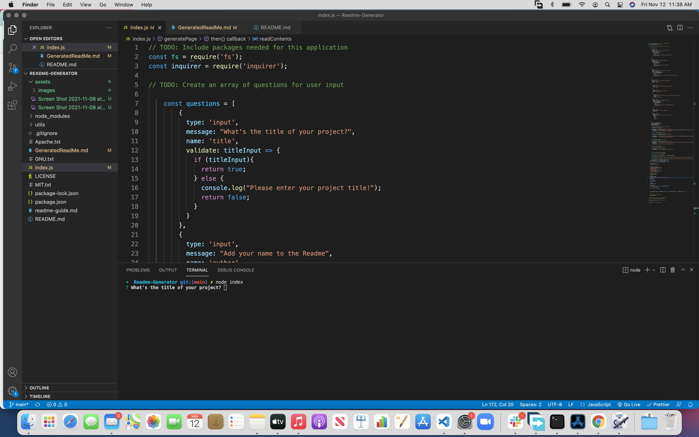
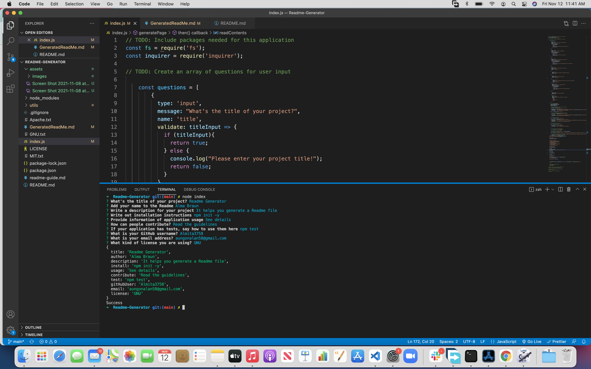
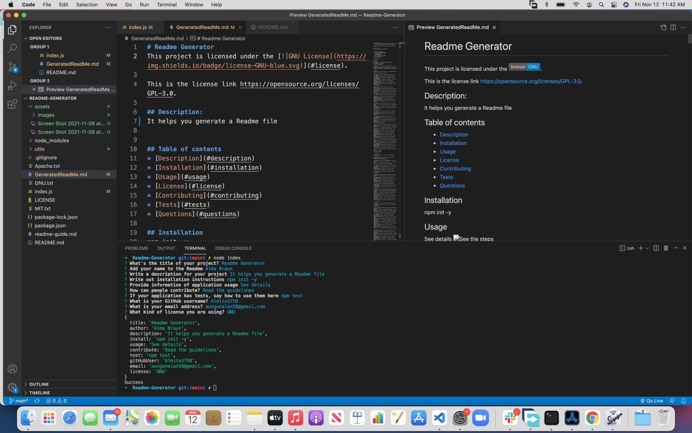

# Generate-Readme-File-With-Inquirer
This project is licensed under the 
    .

This is the license link  https://opensource.org/licenses/MIT.
 

## Description:
It helps you generate a readme file faster for your project.
   
   
## Table of contents
* [Description](#description)
* [Installation](#installation)
* [Usage](#usage)
* [License](#license)
* [Contributing](#contributing)
* [Tests](#tests)
* [Questions](#questions)
   
## Installation
npm init -y

## Usage
Follow the steps
Install node.js, download the file in your computer and open in VS code or terminal. Run node index.js and answer all the questions.

## License
MIT License

Copyright (c) 2021 Alma Braun

Permission is hereby granted, free of charge, to any person obtaining a copy
of this software and associated documentation files (the "Software"), to deal
in the Software without restriction, including without limitation the rights
to use, copy, modify, merge, publish, distribute, sublicense, and/or sell
copies of the Software, and to permit persons to whom the Software is
furnished to do so, subject to the following conditions:

The above copyright notice and this permission notice shall be included in all
copies or substantial portions of the Software.

THE SOFTWARE IS PROVIDED "AS IS", WITHOUT WARRANTY OF ANY KIND, EXPRESS OR
IMPLIED, INCLUDING BUT NOT LIMITED TO THE WARRANTIES OF MERCHANTABILITY,
FITNESS FOR A PARTICULAR PURPOSE AND NONINFRINGEMENT. IN NO EVENT SHALL THE
AUTHORS OR COPYRIGHT HOLDERS BE LIABLE FOR ANY CLAIM, DAMAGES OR OTHER
LIABILITY, WHETHER IN AN ACTION OF CONTRACT, TORT OR OTHERWISE, ARISING FROM,
OUT OF OR IN CONNECTION WITH THE SOFTWARE OR THE USE OR OTHER DEALINGS IN THE
SOFTWARE.

## Contributing
Read the guidelines
[Covenant Contributor](https://www.contributor-covenant.org/)

## Tests
npm test

Git clone https://github.com/ALMA-DEV914

## Questions
For questions please contact: Alma Braun
at  aungonalna58@gmail.com

Github Profile: https://github.com/ALMA-DEV914 